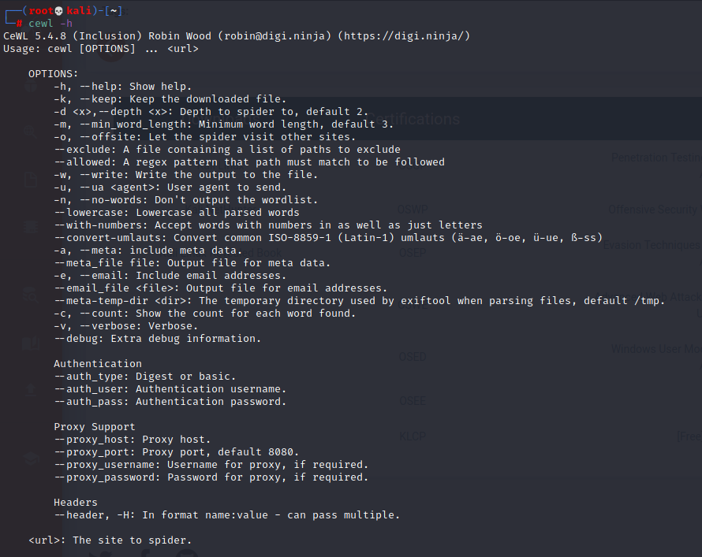

---
# 这是页面的图标
icon: page
# 这是文章的标题
title: cewl
# 设置作者
author: lhz
# 设置写作时间
time: 2021-09-15
# 一个页面只能有一个分类
category: 安全工具
# 一个页面可以有多个标签
tag:
  - 安全工具

comment: false
---
## cewl
cewl是一个 [ruby](http://www.codercto.com/category/ruby.html) 应用，爬行指定url的指定深度。也可以跟一个外部链接，结果会返回一个单词列表，这个列表可以扔到John the ripper工具里进行密码破解。cewl还有一个相关的命令行 [工具](http://www.codercto.com/tool.html) 应用FAB，它使用相同的元数据提取技术从已下载的列表中创建作者/创建者列表。



### 默认方法

```bash
cewl http://dc-2/
```

### 将字典保存到文件中

```bash
cewl http://dc-2/ -w dict.txt
```

### 生成指定长度的字典

```
cewl http://dc-2/ -m 9
```

### 从网站获取email地址

```bash
cewl http://dc-2/ -n -e
```

### 计算网站中单词重复的次数

```
cewl http://dc-2/ -c
```

### 增加爬行深度

```
cewl http://dc-2/ -d 3
```

### 显示调试信息

```
cewl http://dc-2/ -debug
```

### Verbose模式

不会生成字典，而是会dump网站信息

```
cewl http://dc-2/ -v
```

### 生成字母数字字典

```
cewl http://dc-2/ --with-numbers
```

